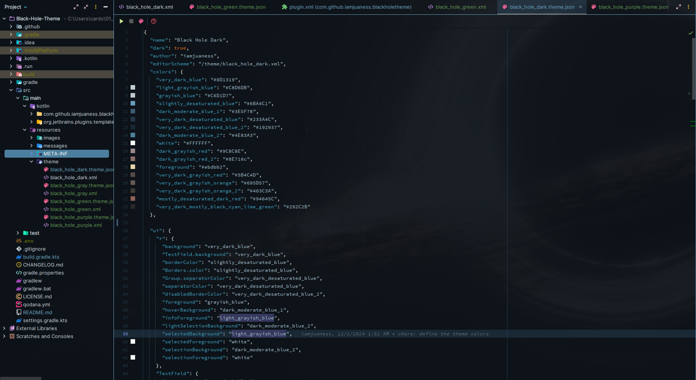
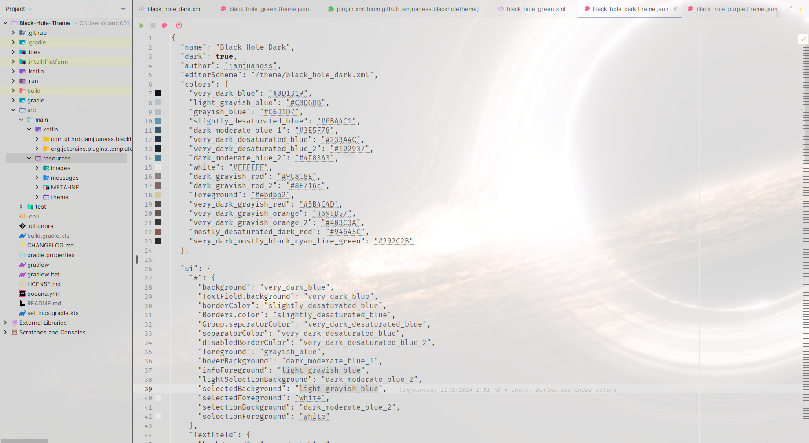
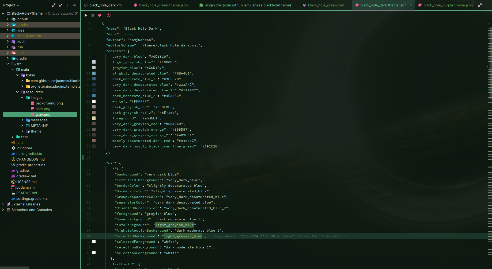
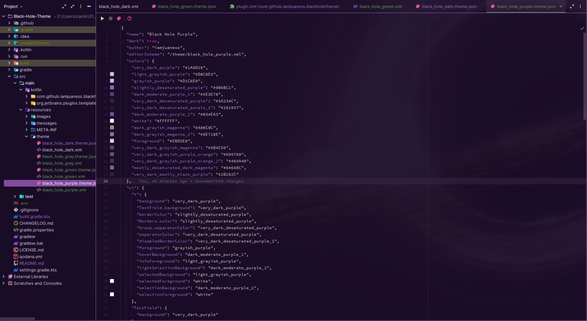

<div align="center">
    <a href="https://plugins.jetbrains.com/plugin/25984-black-hole-theme">
        
    </a>
</div>

<div align="center">

<h1 align="center">Black Hole Theme</h1>

**A modern, customizable theme collection for all JetBrains IDEs**

[](https://github.com/iamjuaness/Black-Hole-Theme/actions)
[](https://plugins.jetbrains.com/plugin/25984-black-hole-theme)
[](https://plugins.jetbrains.com/plugin/25984-black-hole-theme)
[](https://opensource.org/licenses/MIT)

[JetBrains Marketplace](https://plugins.jetbrains.com/plugin/25984-black-hole-theme) • [Report Bug](https://github.com/iamjuaness/Black-Hole-Theme/issues) • [Request Feature](https://github.com/iamjuaness/Black-Hole-Theme/issues)

</div>

---

## ✨ Overview
<!-- Plugin description -->
Black Hole Theme is a carefully crafted theme collection designed to enhance your development experience across all JetBrains IDEs. Inspired by the depth and mystery of cosmic phenomena, this theme suite offers **4 distinct color variants** to match your coding style and environment preferences.
<!-- Plugin description end -->
### Supported IDEs

AppCode • CLion • DataGrip • GoLand • IntelliJ IDEA • PhpStorm • PyCharm • Rider • RubyMine • WebStorm

---

## 🎨 Theme Variants

Black Hole Theme comes with **four carefully designed color schemes** to suit different preferences and coding styles:

### 1. **Black Hole Dark** (Original)
The classic deep space theme with high contrast and vibrant accents. Perfect for extended coding sessions in low-light environments.



### 2. **Black Hole Gray**
A sophisticated monochromatic variant with balanced neutral tones, ideal for minimalist enthusiasts and distraction-free coding.



### 3. **Black Hole Green**
An energetic variant featuring emerald and forest green accents, bringing a fresh, natural vibe to your development environment.



### 4. **Black Hole Purple**
A cosmic variant with deep purple and violet hues, combining elegance with creativity for an inspiring coding atmosphere.



---

## 🚀 Installation

### Via JetBrains Marketplace (Recommended)

1. Open your JetBrains IDE
2. Navigate to `Settings/Preferences` → `Plugins` → `Marketplace`
3. Search for **"Black Hole Theme"**
4. Click `Install` and restart your IDE
5. Go to `Settings/Preferences` → `Appearance & Behavior` → `Appearance`
6. Select your preferred theme variant from the dropdown

### Via JetBrains Website

Visit the [JetBrains Marketplace page](https://plugins.jetbrains.com/plugin/25984-black-hole-theme) and click **"Install to..."** to automatically install the plugin to your running IDE.

### Manual Installation

1. Download the [latest release](https://github.com/iamjuaness/Black-Hole-Theme/releases/latest)
2. Open `Settings/Preferences` → `Plugins` → ⚙️ → `Install plugin from disk...`
3. Select the downloaded `.zip` file
4. Restart your IDE

---

## 🎯 Features

- **4 Distinct Themes**: Choose the perfect variant for your environment and mood
- **Optimized Syntax Highlighting**: Carefully selected colors for maximum code readability
- **Reduced Eye Strain**: Thoughtful contrast ratios designed for long coding sessions
- **Complete IDE Coverage**: Consistent theming across all UI elements
- **Regular Updates**: Active maintenance and improvements based on community feedback
- **Universal Compatibility**: Works seamlessly across all JetBrains IDEs

---

## 🛠️ Building from Source

### Prerequisites

- JDK 17 or higher
- Gradle (included via wrapper)

### Build Steps

```bash
# Clone the repository
git clone https://github.com/iamjuaness/Black-Hole-Theme.git
cd Black-Hole-Theme

# Build the plugin
./gradlew buildPlugin

# The plugin will be located in ./build/distributions

```

---

## 🤝 Contributing
Contributions are welcome! Whether it's bug reports, feature requests, or code contributions, your input helps make 
Black Hole Theme better for everyone.

### Ways to Contribute
- 🐛 [Report bugs](https://github.com/iamjuaness/Black-Hole-Theme/issues)

- 💡 [Request features](https://github.com/iamjuaness/Black-Hole-Theme/issues)

- 🎨 Suggest color improvements

- 📝 Improve documentation

- 🔧 Submit pull requests

### Development Resources
- [Platform Theme Colors Documentation](https://jetbrains.design/intellij/principles/platform_theme_colors/#UI-components)
- [IntelliJ Platform Plugin Template](https://github.com/JetBrains/intellij-platform-plugin-template)

---

## 📊 Project Status
[!NOTE]
Black Hole Theme is actively maintained and continuously improved. While stable for daily use, new features and refinements are regularly added.

---

## 📜 License
This project is licensed under the MIT License - see the [LICENSE.md](https://github.com/iamjuaness/Black-Hole-Theme/blob/main/LICENSE) file for details.

---

## 🌟 Support
If you enjoy using Black Hole Theme, consider:

- ⭐ Starring the repository

- 🔄 Sharing it with fellow developers

⭐ Rating it on the [JetBrains Marketplace](https://plugins.jetbrains.com/plugin/25984-black-hole-theme)

- 💬 Providing feedback through [Issues](https://github.com/iamjuaness/Black-Hole-Theme/issues)

---

## 🔗 Links
- JetBrains Marketplace: [Black Hole Theme Plugin Page](https://plugins.jetbrains.com/plugin/25984-black-hole-theme)

- GitHub Repository: [iamjuaness/Black-Hole-Theme](https://github.com/iamjuaness/Black-Hole-Theme)

- Latest Release: [Download Here](https://github.com/iamjuaness/Black-Hole-Theme/releases/latest)

---

<div align="center">

  Made with ☕ by [Juanes Cardona](https://github.com/iamjuaness)
  
</div>